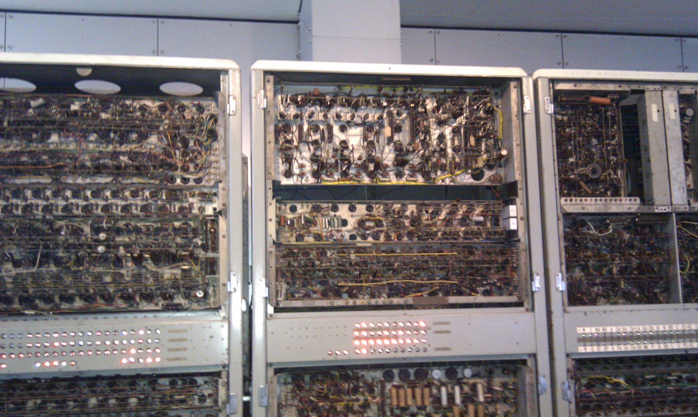

CSIRAC Schematics
=================

[CSIRAC](https://en.wikipedia.org/wiki/CSIRAC) was Australia's first
computer, the fifth stored program computer to ever exist, and the
first computer to ever play music.

CSIRAC is very important to Australians and Australian programmers
like myself.  I saw it in person in 2012 in Melbourne, which was a
highlight of my life.  As of 2025 it is located at Scienceworks Melbourne.

An [emulator](https://cis.unimelb.edu.au/about/csirac/emulator) for
Windows 98 does exist, which replicates the original experience of
flipping toggle switches to operate the machine and looking at the
oscilloscope tubes to see what is in memory.

## What is this project?

The schematics were available on the [Museums Victoria](https://museumsvictoria.com.au/)
website, so I downloaded them to get a better understanding of the machine.
The schematics are listed below, organised into functionality areas.

One day I want to try making a Logisim simulation of the machine, or at
least part of it.  Ultimately, I would like to see if I can get classic
CSIRAC code to run via direct simulation of the logic gates.

## Architecture and instruction set

For general information about the architecture of the CSIRAC and the
instruction set, see [this page](doc/architecture.md).

## A first look at the schematics

Vacuum tube computers (or "valve computers" in Australian English)
are hard!  What is even happening here?!?  (Click for the full schematic)

That's a portion of the "Sequence Unit Mk II" schematic.  Fortunately,
there are "logical diagrams" that show the logical structure of the machine
in terms of AND gates, OR gates, flip-flops, and so on.  Let's take a
look at the corresponding logical diagram (click for the full diagram):

Yeah, that isn't helping!  The CSIRAC was designed before many of the
conventions for standard logic symbols existed.  So the diagrams are
inscrutable to modern readers.

After much head-scratching, I managed to come up with a [legend](doc/legend.md)
that maps the symbols to what we understand today.  Circles with numbers
correspond to buffers, AND gates, and OR gates.  Rounded rectangles
correspond to flip-flops.

"Plugs" that connect different parts of the computer are labelled "P9",
"P59", etc.  Plugs correspond to individual control signals or sometimes to
whole buses.  [This page](doc/plugs.md) documents the plugs I have been able
to figure out.

## Terminology

CSIRAC uses odd terms for the components of the computer.  This table maps
some of them to more modern terminology:

<table border="1">
<tr><td><b>CSIRAC Term</b></td><td><b>Modern Term</b></td></tr>
<tr><td>Arithmetic Organ</td><td>Arithmetic and Logic Unit (ALU)</td></tr>
<tr><td>Chain Unit</td><td>Shift Register</td></tr>
<tr><td>Circulator</td><td>Carry Bit / Shift Register</td></tr>
<tr><td>Intepreter</td><td>Instruction Register</td></tr>
<tr><td>Sequence Register</td><td>Program Counter</td></tr>
<tr><td>Sequence Unit</td><td>Timing and Control</td></tr>
<tr><td>Uniselector Input</td><td>Power on Sequence Control</td></tr>
<tr><td>Unit Selector</td><td>Decoder</td></tr>
</table>

## Schematics and other drawings

Most of the drawings are schematics, except for those that are
explicitly marked.

Arithmetic and Logic

* [Arithmetic Organ of Computor](drawings/226971-large-arithmetic-organ.jpg) (AO2 and AO3 Logical)
* [Arithmetic Organ AO2](drawings/226954-large-schematic-a02.jpg)
* [Arithmetic Organ AO2](drawings/295250-large-arithmetic-organ-a02.jpg) (Alternative Schematic for AO2)
* [Arithmetic Organ AO3](drawings/226955-large-schematic-a03.jpg)
* [Arithmetic Organ AO4](drawings/226991-large-arithmetic-organ-ao4.jpg) (AO4 Logical)
* [Adder](drawings/226968-large-adder.jpg)
* [Block Diagram of an Adding Unit](drawings/256456-large-adding-unit.jpg) (Drawing)
* [Constant Generator](drawings/226969-large-constant-generator.jpg)
* [Circulator Mk 2](drawings/227003-large-mk2-circulator.jpg)

Clocks and Timing

* [Clock](drawings/226953-large-clock.jpg)
* [Clock Generator](drawings/226982-large-clock-generator.jpg)
* [Clock No. 2](drawings/226988-large-clock-no2.jpg)
* [Sequence Register Mk II](drawings/227008-large-mk2-sequence-register.jpg) (Logical)
* [Block Sequence Unit Mk II](drawings/226976-large-block-sequence-unit-mk2.jpg) (Logical)
* [Sequence Unit Mk II](drawings/226958-large-sequence-unit-mk2.jpg)
* [Sequence Unit Mk II Waveforms](drawings/226975-large-sequence-unit-mk2-waveforms.jpg) (Signal Waveforms)
* [Multiplier Sequence Unit](drawings/226990-large-multiplier-sequence-unit.jpg) (Logical and Signal Waveforms)
* [Multiplier Sequence Unit](drawings/226967-large-multiplier-sequence-unit.jpg)
* [Time Selector Mark II](drawings/226970-large-time-selector-mk2.jpg)
* [IO M/C Generator](drawings/227001-large-io-mc-generator.jpg)
* [Oscillator 5-15 Mc/s C.W. Schematic](drawings/227009-large-oscillator-5-15-mcs.jpg)

Registers

* [C Register - Stop : Shift Left](drawings/226997-large-c-register-stop-shift-left.jpg)
* [D Register](drawings/226964-large-d-register.jpg)
* [H Register](drawings/226966-large-h-register.jpg)
* [Sequence Register](drawings/227010-large-sequence-register-logical.jpg) (Logical) - Program counter.
* [Sequence Register](drawings/227014-large-sequence-register.jpg) - Program counter.
* Note: A and B registers are part of the Arithmetic Organ.

Instruction Decoding

* [Interpreter](drawings/227015-large-interpreter.jpg) (Logical) - Instruction register.
* [Interpreter](drawings/227016-large-interpreter.jpg) - Instruction register.
* [Unit Selector](drawings/226965-large-unit-selector.jpg) - Decodes a 5-bit opcode into one of 32 control lines.  There are two of these in the machine for the source and destination opcodes.

Memory

* [Memory](drawings/226995-large-memory-logical.jpg) (Logical)
* [Memory Input Gates](drawings/226962-large-memory-input-gates.jpg)
* [Memory Output Gates](drawings/226984-large-memory-output-gates.jpg)
* [Mercury Delay Line Sub-Assembly](drawings/227005-large-mercury-delay-line-subassembly.jpg) (Drawing)
* [Mercury Delay Line Assembly 10 Mc/s 963 Micro. Secs.](drawings/227006-large-mercury-delay-line-assembly.jpg) (Drawing)
* [Memory Clock Generator Mk 2](drawings/227002-large-mk2-memory-clock-generator.jpg)
* [Output Register](drawings/226996-large-output-register-logical.jpg) (Logical)
* [Output Driver](drawings/226998-large-output-driver.jpg)
* [Line Selector](drawings/226972-large-line-selector.jpg)
* [Line Modulator](drawings/226999-large-line-modulator.jpg)
* [Line Amplifier Mk II](drawings/227000-large-line-amplifier-mk2.jpg)
* [Chain Unit](drawings/226985-large-chain-unit.jpg) - Serial-in / parallel-out shift register for the current 20-bit word.
* [Chain Output](drawings/226986-large-chain-output.jpg) - Cathode-follower buffers for the output of the Chain Unit.

Teleprinter and Tape Punch

* [Teleprinter Control](drawings/226981-large-teleprinter-control.jpg)
* [Tape Punch Mark II Detail Drawings No. 1](drawings/226992-large-tape-punch-mark-detail-drawings.jpg) (Drawing)
* [Tape Punch Mark II Detail Drawings No. 2](drawings/226993-large-tape-punch-mark-2-detail-drawings.jpg) (Drawing)
* [Card Punch Control Schematic](drawings/226994-large-card-punch-control-schematic.jpg)
* [Tape Reader Mk II Amplifier](drawings/227007-large-tape-reader-mk2-amplifier.jpg)
* [Tape Reader Controls Mk II](drawings/227011-large-mk2-tape-reader-controls.jpg)
* [Editing Control](drawings/226973-large-editing-control.jpg)

Magnetic Drum

* [Magnetic Drum Position Selector Unit](drawings/226959-large-magnetic-drum-position-selector.jpg)
* [Magnetic Drum Sequence Unit](drawings/226961-large-magnetic-drum-sequence-unit.jpg)
* [Magnetic Storage System, Input Register, and Writing Circuits](drawings/226977-large-magnetic-storage-input-and-writing-circuits.jpg)
* [Magnetic Drum - Output Register Circuit Diagram](drawings/226978-large-magnetic-drum-output-register.jpg)
* [Magnetic Drum Store](drawings/226979-large-magnetic-drum-store-block-schematic.jpg) (Logical)
* [Magnetic Drum Sequence Unit Waveforms](drawings/226980-large-magnetic-drum-sequence-unit-waveforms.jpg) (Signal Waveforms)
* [Clock Track Writing Unit](drawings/226987-large-clock-track-writing-unit.jpg)
* [Magnetic Disk Assembly](drawings/227017-large-magnetic-disk-assembly.jpg) (Drawing)

Power Supply

* [Power Supply No. 1](drawings/226956-large-power-supply-no-1.jpg)
* [Power Supply No. 2](drawings/226957-large-power-supply-no-2.jpg)
* [Test Power Supply](drawings/227004-large-test-power-supply.jpg)

Other

* [Adder Supply - Hooter - Start Unit](drawings/226974-large-adder-supply-hooter-start.jpg)
* [Interspacing Montior Circuit](drawings/226983-large-interspacing-monitor-circuit.jpg)
* [Monitor Unit for Electronic Computer](drawings/296560-large-monitor-unit.jpg)
* [Operation Control Relay Unit](drawings/226989-large-operation-control-relay-unit.jpg)
* [Trigger Unit](drawings/227013-large-trigger-unit.jpg)
* [Uniselector Input](drawings/226960-large-uniselector-input.jpg)
* [Valve Tester](drawings/226963-large-valve-tester.jpg)
* [Detail 6](drawings/295132-large-detail-6.jpg) (Drawing)
* [Detail 7](drawings/227012-large-detail-7.jpg) (Drawing)

## CSIRAC in person

Here are some photos of the CSIRAC that I took in 2012 when I visited
Melbourne (right-click and open in a new tab for larger versions).
Note that the lights on the front are fake - it isn't running.

## Contact

For more information on this project, to report bugs, or to suggest
improvements, please contact the author Rhys Weatherley via
[email](mailto:rhys.weatherley@gmail.com).
