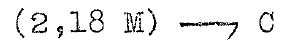
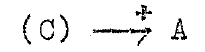

Architecture of the CSIRAC
==========================

The [Programming Manual](UoM.CSIRAC.Programming.Manual.1958-06.pdf)
contains a lot of information on how the machine
works, both at a physical level of vaccuum tubes and mercury delay lines,
and at a logical level for programming it.

The terminology is a little obscure to modern readers.  Values in registers,
memory, and on-the-fly computations are referred to as "pulse trains".
This comes from how the 20-bit words are represented as a series of
pressure pulses in a mercury delay line.  I'll just call them "words".

Source and destination words in an instruction are referred to as "gates".
This comes from the AND and OR gates in the computer that select a specific
source or destination and connects it to the main data bus.

The machine operates in a bit-serial fashion for operations like
addition.  Pulses emerge from mercury delay lines representing registers or
memory one at a time, are added together bit by bit and the result is
injected back into the mercury delay lines as new pulses.  Hence, "pulse train".

Pulse trains are written in binary in 5-bit groups, or as a tuple of
values in base-32.  The following are equivalent:

    01001 10011 00110 11011
    (9, 19, 6, 27)

By convention, the bits are numbered P1 to P20 where P1 is the least
significant bit on the right, and P20 is the most significant bit
on the left.

For our purposes, we can ignore pulse trains and mercury delay lines entirely
and focus on the 20-bit words that make up the machine:

* 1024 words of mercury delay line memory (only 768 were fitted in the original machine)
* 4096 words of magnetic drum memory
* 20 arithmetic registers: A, B, C, H, D0, D1, ..., D15
* Sequence register S (what we would call a "program counter" today)
* Interpreter register (what we would call an "instruction register" today)
* 2 general-purpose input registers: N1 and N2
* Punch tape input: I
* Teleprinter output: Ot
* Punch tape output: Op
* Loudspeaker register P for sound output
* Stop register T that halts the machine when a 1 is written to it

All registers are 20-bit except for H and S which are 10-bit.  H can be used to
operate on the top or bottom halves of words.  S indexes main memory for the
program counter.

Instructions (or "commands" in CSIRAC parlance) are made up of three
fields from the top-most to the bottom-most bit of a word:

* 10 bits for a memory address or a D register number.
* 5 bits for the "source gate".
* 5 bits for the "destination gate".

## Notation

There are two kinds of notation that existed back in the day: the original
CSIRO notation and the modified Melbourne University notation after the
machine was moved from Sydney to Melbourne.  We'll start with the CSIRO
notation.

Every instruction is a move with optional operations performed on the
data during the move.  For example, the following moves the contents
of memory location 2 * 32 + 18 = 82 into the C register:

    (2, 18 M) -> C

The following reads the contents of the C register and adds it to the
A register:

    (C) -> +A

I am using `->` here to represent the move operation.  The original
manual uses a hook symbol with an optional operator on top:

Modern keyboards can't type that!  I have ASCII-ified the CSIRO notation.

It is important to remember that the original CSIRAC programmers would
not have typed notation like the above into the computer.  Initially,
they would have written the code by hand on paper and then hand-assembled it
into numeric pulse trains.  The pulse trains were then punched on tape and
fed into the computer.  The hook notation is ideal for hand-written
programs, just not for computer-written ones.

After the machine was moved to Melbourne, the researchers devised a
simpler notation that used uppercase letters and numbers only:

    (2, 18 M) -> C              2  18  M  C
    (C) -> +A                   0   0  C PA

There even was a disassembler program which produced output like the
following when a 12-hole program tape was disassembled:

     0 14           HU PS
     0 15        24  M PA
     0 16        23  M PA
     0 17        15  M PA
     0 18        19 CA  M
     0 19           PS  T
     0 20     31 21  K PK
     0 21        11  K  B
     0 22        10  K  S
     0 23           RB MA
     0 24     31  8  R  C

This is the "Melbourne Mnemonic Form".  The CSIRO and Melbourne forms are
listed below.

## Source Gates

<table border="1">
<tr><td><b>Source</b></td><td><b>CSIRO</b></td><td><b>Melbourne</b></td><td><b>Description</b></td></tr>
<tr><td>0</td><td><tt>(n M)</tt> or <tt>(n)</tt></td><td><tt>n M</tt></td><td>Read the contents of location <tt>n</tt> in main memory</td></tr>
<tr><td>1</td><td><tt>(I)</tt></td><td><tt>I</tt></td><td>Read a word from the input tape and shift the tape one position</td></tr>
<tr><td>2</td><td><tt>(N1)</tt></td><td><tt>NA</tt></td><td>Read the contents of general-purpose input register N1</td></tr>
<tr><td>3</td><td><tt>(N2)</tt></td><td><tt>NB</tt></td><td>Read the contents of general-purpose input register N2</td></tr>
<tr><td>4</td><td><tt>(A)</tt></td><td><tt>A</tt></td><td>Read the contents of the A register</td></tr>
<tr><td>5</td><td><tt>s(A)</tt></td><td><tt>SA</tt></td><td>Read the contents of the MSB from the A register (sign bit)</td></tr>
<tr><td>6</td><td><tt>r(A)</tt></td><td><tt>HA</tt></td><td>Read the contents of the A register, shifted right by 1 bit with a zero bit inserted at the top (divide A by 2)</td></tr>
<tr><td>7</td><td><tt>2(A)</tt></td><td><tt>TA</tt></td><td>Read the contents of the A register, shifted left by 1 bit with a zero bit inserted at the bottom (multiply A by 2)</td></tr>
<tr><td>8</td><td><tt>p1(A)</tt></td><td><tt>LA</tt></td><td>Read the contents of the LSB from the A register (p1 = bit position 1)</td></tr>
<tr><td>9</td><td><tt>c(A)</tt></td><td><tt>CA</tt></td><td>Read the contents of the A register and then clear it to zero</td></tr>
<tr><td>10</td><td><tt>z(A)</tt></td><td><tt>ZA</tt></td><td>Reads as 1 if register A is non-zero, or read as 0 if A is zero</td></tr>
<tr><td>11</td><td><tt>(B)</tt></td><td><tt>B</tt></td><td>Read the contents of the B register</td></tr>
<tr><td>12</td><td><tt>(R)</tt></td><td><tt>R</tt></td><td>Read the contents of the MSB from the B register (sign bit)</td></tr>
<tr><td>13</td><td><tt>r(B)</tt></td><td><tt>RB</tt></td><td>Read the contents of the B register, shifted right by 1 bit with a zero bit inserted at the top (divide B by 2)</td></tr>
<tr><td>14</td><td><tt>(C)</tt></td><td><tt>C</tt></td><td>Read the contents of the C register</td></tr>
<tr><td>15</td><td><tt>s(C)</tt></tt></td><td><tt>SC</tt></td><td>Read the contents of the MSB from the C register (sign bit)</td></tr>
<tr><td>16</td><td><tt>r(C)</tt></td><td><tt>RC</tt></td><td>Read the contents of the C register, shifted right by 1 bit with a zero bit inserted at the top (divide C by 2)</td></tr>
<tr><td>17</td><td><tt>(Dn)</tt></td><td><tt>n D</tt></td><td>Read the contents of the Dn register, where n is between 0 and 15.  The D register number is in the low 4 bits of the address field of the instruction.</td></tr>
<tr><td>18</td><td><tt>s(Dn)</tt></tt></td><td><tt>n SD</tt></td><td>Read the contents of the MSB from the Dn register (sign bit)</td></tr>
<tr><td>19</td><td><tt>r(Dn)</tt></td><td><tt>n RD</tt></td><td>Read the contents of the Dn register, shifted right by 1 bit with a zero bit inserted at the top (divide Dn by 2)</td></tr>
<tr><td>20</td><td><tt>(Z)</tt></td><td><tt>Z</tt></td><td>Read a word with the value zero</td></tr>
<tr><td>21</td><td><tt>(Hl)</tt></td><td><tt>HL</tt></td><td>Read the 10-bit contents of H into the lower 10 bits of the result</td></tr>
<tr><td>22</td><td><tt>(Hu)</tt></td><td><tt>HU</tt></td><td>Read the 10-bit contents of H into the upper 10 bits of the result</td></tr>
<tr><td>23</td><td><tt>(S)</tt></td><td><tt>S</tt></td><td>Read the 10-bit contents of the sequence register S into the upper 10 bits of the result</td></tr>
<tr><td>24</td><td><tt>p11</tt></td><td><tt>PE</tt></td><td>Read a word with all zeroes except a 1 in bit position 11</td></tr>
<tr><td>25</td><td><tt>p1</tt></td><td><tt>PL</tt></td><td>Read a word with all zeroes except a 1 in bit position 1 (LSB)</td></tr>
<tr><td>26</td><td><tt>(nK)</tt> or <tt>n</tt></td><td><tt>n K</tt></td><td>Read the top 10 bits of the interpreter register into the top 10 bits of the result (loads the constant n)</td></tr>
<tr><td>27</td><td><tt>(na)</tt></td><td><tt>n MA</tt></td><td>Read the contents of location <tt>n</tt> in magnetic drum store 1</td></tr>
<tr><td>28</td><td><tt>(nb)</tt></td><td><tt>n MB</tt></td><td>Read the contents of location <tt>n</tt> in magnetic drum store 2</td></tr>
<tr><td>29</td><td><tt>(nc)</tt></td><td><tt>n MC</tt></td><td>Read the contents of location <tt>n</tt> in magnetic drum store 3</td></tr>
<tr><td>30</td><td><tt>(nd)</tt></td><td><tt>n MD</tt></td><td>Read the contents of location <tt>n</tt> in magnetic drum store 4</td></tr>
<tr><td>31</td><td><tt>p20</tt></td><td><tt>PS</tt></td><td>Read a word with all zeroes except a 1 in bit position 20 (MSB)</td></tr>
</table>

## Destination Gates

<table border="1">
<tr><td><b>Destination</b></td><td><b>CSIRO</b></td><td><b>Melbourne</b></td><td><b>Description</b></td></tr>
<tr><td>0</td><td><tt>n M</tt> or <tt>n</tt></td><td><tt>n M</tt></td><td>Writes the current value to location <tt>n</tt> in main memory</td></tr>
<tr><td>1</td><td><tt>I</tt></td><td><tt>I</tt></td><td>Does nothing</td></tr>
<tr><td>2</td><td><tt>Ot</tt></td><td><tt>OT</tt></td><td>Forms the logical OR of P1..P5 and P11..P15 and prints the corresponding character on the teleprinter.</td></tr>
<tr><td>3</td><td><tt>Op</tt></td><td><tt>OP</tt></td><td>Punches this value onto the output tape or the Flexowriter.</td></tr>
<tr><td>4</td><td><tt>A</tt></td><td><tt>A</tt></td><td>Writes the current value to the A register</td></tr>
<tr><td>5</td><td><tt>+A</tt></td><td><tt>PA</tt></td><td>Adds the current value to the A register and writes the result to the A register</td></tr>
<tr><td>6</td><td><tt>-A</tt></td><td><tt>SA</tt></td><td>Subtracts the current value from the A register and writes the result to the A register</td></tr>
<tr><td>7</td><td><tt>.A</tt></td><td><tt>CA</tt></td><td>AND's the current value with the A register and writes the result to the A register (conjunction)</td></tr>
<tr><td>8</td><td><tt>vA</tt></td><td><tt>DA</tt></td><td>OR's the current value with the A register and writes the result to the A register (disjunction)</td></tr>
<tr><td>9</td><td><tt>&ne;A</tt> or <tt>~A</tt></td><td><tt>NA</tt></td><td>XOR's the current value with the A register and writes the result to the A register (inequality comparison)</td></tr>
<tr><td>10</td><td><tt>P</tt></td><td><tt>P</tt></td><td>Writes the current value to the loudspeaker</td></tr>
<tr><td>11</td><td><tt>B</tt></td><td><tt>B</tt></td><td>Writes the current value to the B register</td></tr>
<tr><td>12</td><td><tt>xB</tt></td><td><tt>XB</tt></td><td>Writes the current value to the B register.  Then multiplies B and C with the upper 20 bits of the result added to A and the low 19 bits of the result written back to B with the LSB of B set to zero.</td></tr>
<tr><td>13</td><td><tt>Lx</tt></td><td><tt>L</tt></td><td>Cyclic left shift of the contents of the register pair AB by a number of places</td></tr>
<tr><td>14</td><td><tt>C</tt></td><td><tt>C</tt></td><td>Writes the current value to the C register</td></tr>
<tr><td>15</td><td><tt>+C</tt></td><td><tt>PC</tt></td><td>Adds the current value to the C register and writes the result to the C register</td></tr>
<tr><td>16</td><td><tt>-C</tt></td><td><tt>SC</tt></td><td>Subtracts the current value from the C register and writes the result to the C register</td></tr>
<tr><td>17</td><td><tt>Dn</tt></td><td><tt>n D</tt></td><td>Writes the current value to the Dn register, where n is between 0 and 15.  The D register number is in the low 4 bits of the address field of the instruction.</td></tr>
<tr><td>18</td><td><tt>+Dn</tt></td><td><tt>n PD</tt></td><td>Adds the current value to the Dn register</td></tr>
<tr><td>19</td><td><tt>-Dn</tt></td><td><tt>n SD</tt></td><td>Subtracts the current value from the Dn register</td></tr>
<tr><td>20</td><td><tt>Z</tt></td><td><tt>Z</tt></td><td>Does nothing</td></tr>
<tr><td>21</td><td><tt>Hl</tt></td><td><tt>HL</tt></td><td>Writes the lower 10 bits of the current value into the H register</td></tr>
<tr><td>22</td><td><tt>Hu</tt></td><td><tt>HU</tt></td><td>Writes the upper 10 bits of the current value into the H register</td></tr>
<tr><td>23</td><td><tt>S</tt></td><td><tt>S</tt></td><td>Writes the upper 10 bits of the current value into the S register (absolute jump)</td></tr>
<tr><td>24</td><td><tt>+S</tt></td><td><tt>PS</tt></td><td>Adds the upper 10 bits of the current value to the S register (relative jump)</td></tr>
<tr><td>25</td><td><tt>cS</tt></td><td><tt>CS</tt></td><td>Skips the next instruction if any of the bits P1..P11 or P15..P20 in the current value are non-zero.  But not both.</td></tr>
<tr><td>26</td><td><tt>+K</tt></td><td><tt>PK</tt></td><td>Adds the current value to the next instruction to be executed and then execute the resulting instruction.</td></tr>
<tr><td>27</td><td><tt>na</tt></td><td><tt>n MA</tt></td><td>Writes the current value to location <tt>n</tt> in magnetic drum store 1</td></tr>
<tr><td>28</td><td><tt>nb</tt></td><td><tt>n MB</tt></td><td>Writes the current value to location <tt>n</tt> in magnetic drum store 2</td></tr>
<tr><td>29</td><td><tt>nc</tt></td><td><tt>n MC</tt></td><td>Writes the current value to location <tt>n</tt> in magnetic drum store 3</td></tr>
<tr><td>30</td><td><tt>nd</tt></td><td><tt>n MD</tt></td><td>Writes the current value to location <tt>n</tt> in magnetic drum store 4</td></tr>
<tr><td>31</td><td><tt>T</tt></td><td><tt>T</tt></td><td>If one of the bits in the current value is non-zero, then halt the computer.  Otherwise continue.</td></tr>
</table>

## NOP's

The simplest no-operation instruction is this:

    (Z) -> Z

Sometimes a no-operation can have a side-effect.  The following reads the
next word from the input tape and discards it:

    (I) -> Z

The following no-operation corresponds to the instruction with all zero bits:

    (0 M) -> 0 M

Executing <tt>(0 M) -> 0 M</tt> usually indicates that the program has
jumped off into unused memory.  The emulator treats this as an
"illegal instruction" and stops the program.

## Pointers and Arrays

The <tt>+K</tt> destination can be used to do pointer indirection.
The following example reads from the address in the top 10 bits of C
and puts the result in A:

    (C) -> +K
    (0 M) -> A

This works because <tt>+K</tt> adds the contents of C to the next
instruction before it is executed.

Writing via a pointer is similar:

    (C) -> +K
    (A) -> 0 M

This can be extended to read from arrays by putting the base address
of the array into the following instruction:

    (C) -> +K           ; Load the array index from the top 10 bits of C.
    (.base M) -> A      ; Read the array element into A.

This technique will even work on addresses in magnetic drum memory:

    (C) -> +K           ; Load the array index from the top 10 bits of C.
    (.base a) -> A      ; Read the array element from the magnetic drum into A.

With some cleverness, pointers to any memory location (main or drum)
can be accomodated.  Even pointers to registers!

## Subroutines

Subroutines are not supported explicitly in the bare instruction set.
The easiest is to use one of the registers as a link register:

    .caller:
        (S) -> D15      ; Save the address of the next instruction in D0.
        .callee -> S    ; Jump to the subroutine's entry point.
        ...

    .callee:
        1 -> +D15       ; Add 1 to the return address to skip the call.
        ...
        (D15) -> S      ; Jump back to the return point.

Some arithmetic on D15 is required to skip over the call instruction
when returning.

This method doesn't support recursion, but combined with pointers it should
be possible to create a rudimentary stack using one of the D registers
as a stack pointer.

Nested functions use D15, D14, ..., D0 as link registers with the register
number indicating the subroutine depth.  This does make things difficult
when calling the same subroutine from different depths.
