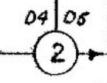
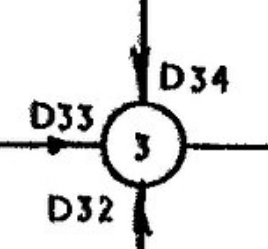
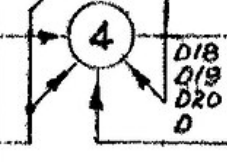
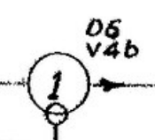
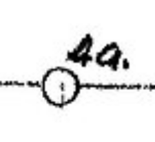
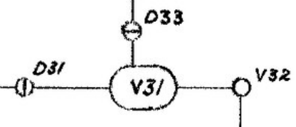
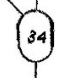
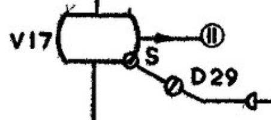
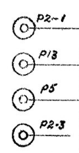
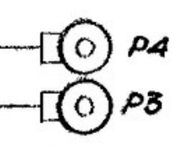

Legend for CSIRAC logic symbols
===============================

Some of the schematic diagrams are "logical" descriptions that show the
logic gates of the component without all the messy details of valves.
However, the CSIRAC was designed before the standard logic symbols we
know and love today were invented.  This file provides a legend for
interpreting the CSIRAC's logical diagrams.

## AND gates

AND gates are represented by a circle with a 2, 3, or 4 in it,
depending upon the number of inputs to the AND gate:

It is common to list the diodes that act as inputs to a gate.  The gate
itself is a valve hooked up in either non-inverting or inverting mode
depending upon the needs of the downstream circuit.

## OR gates

OR gates are rarer than AND gates and are represented by a circle
with a 1 in it.  This one also has an inverted input designated by the
small circle:

This OR gate is implemented by the "b" half of valve V4 (which is a
dual triode).

## Buffers

Buffers are shown as a circle on a line.  This buffer is implemented by the
"a" half of valve V4:

## SR Flip-Flops

SR flip-flops are represented by a rounded rectangle:

Sometimes the set (S) input is labeled, but usually you have to figure out
which input is S and which input is R from context.

## Plugs

Plugs are the interconnects between major components.  They are represented
by two concentric circles, accompanied by the label:

The labels are very unhelpful at indicating what they mean: P2-1, P13, etc.
See [Plugs](plugs.md) for a list of plugs and their uses.

A label with a dash in it indicates that the plug has multiple lines;
usually a bus.  The diagram above uses lines 1 and 3 of bus P2.

There are times where an entire bus is represented by a single plug name.
Such cases have a rectangle attached to the outer circle:

P3 and P4 are the buses for the multi-bit source and destination opcodes.
