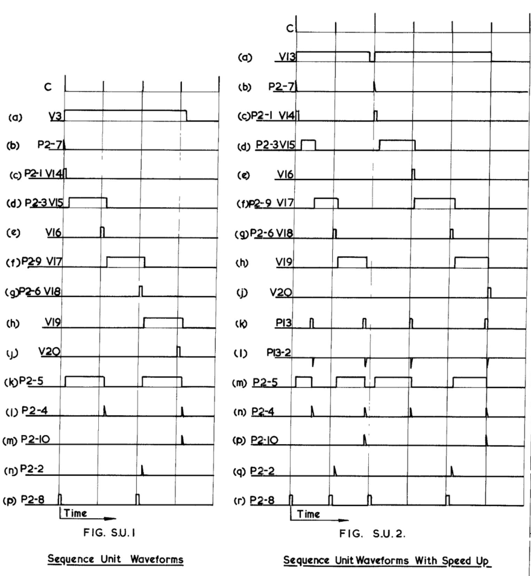

Plug connectors between the CSIRAC components
=============================================

Each of the major cabinets has connectors (or "plugs") carrying
power, data, address lines, control signal, and so on.  The drawings
use labels like "P6", "P4-15", and "P15-20" which aren't terribly helpful.
There are names in some of the schematics but not others.  This file
collects up the names of the known signals.

When the plug name contains a dash, it indicates a bus with multiple pins.
For example, the P15 bus has pins P15-1 to P15-20 for the bits of the
current instruction word.  Bus pinouts are in separate sections below.

<table border="1">
<tr><td><b>Plug</b></td><td><b>Description</b></td><td><b>Schematic</b></td></tr>
<tr><td>P1</td><td>???</td><td>AO2, AO3, Hooter / Start Unit, Constant Generator, Magnetic Drum Sequence Unit, Constant Generator, Mk II Sequence Register, Sequence Register Logical, Trigger Unit, Interpreter</td></tr>
<tr><td>P1a - P1f</td><td>Delay line taps for delayed versions of P1</td><td>Hooter / Start Unit, Adder, Sequence Register Logical</td></tr>
<tr><td>P2</td><td>Bus for timing signals; see below for further details</td><td>Everywhere</td></tr>
<tr><td>P3</td><td>Bus for source opcode control lines; see below for further details</td><td>Everywhere</td></tr>
<tr><td>P4</td><td>Bus for destination opcode control lines; see below for further details</td><td>Everywhere</td></tr>
<tr><td>P5</td><td>INPUT TR.</td><td>AO3, Hooter / Start Unit, Magnetic Drum Store, Magnetic Drum Sequence Unit, C Register, D Register, H Register, Memory Input Gates, Time Selector Mk II, Memory Logical, Output Register Logical, Mk II Sequence Register, Sequence Register Logical, Interpreter</td></tr>
<tr><td>P6</td><td>OUTPUT TRUNK</td><td>AO2, Memory Output Gates, Magnetic Drum Store, Magnetic Drum Sequence Unit, Constant Generator, Time Selector Mk II, Sequence Register Logical, Interpreter</td></tr>
<tr><td>P6A</td><td>???</td><td>Magnetic Drum Sequence Unit</td></tr>
<tr><td>P7</td><td>???</td><td>Line Selector, Time Selector Mk II, Sequence Register Logical, Trigger Unit, Interpreter</td></tr>
<tr><td>P8</td><td>???</td><td>Chain Unit</td></tr>
<tr><td>P9</td><td>???</td><td>AO2, Sequence Unit Mk II, Hooter / Start Unit, Time Selector Mk II, Interpreter</td></tr>
<tr><td>P10</td><td>C PULSES</td><td>AO2</td></tr>
<tr><td>P11</td><td>???</td><td>Multiplier Sequence Unit, Chain Unit</td></tr>
<tr><td>P13</td><td>TC</td><td>AO3, Memory Input Gates, Memory Output Gates, C Register, D Register, H Register, Time Selector Mk II, Memory Logical, Mk II Sequence Register, Sequence Register Logical, Interpreter</td></tr>
<tr><td>P13-2</td><td>???</td><td>Sequence Unit Mk II</td></tr>
<tr><td>P15</td><td>Bus for the current instruction; see below for further details</td><td>Everywhere</td></tr>
<tr><td>P16</td><td>???</td><td>AO2</td></tr>
<tr><td>P18</td><td>???</td><td>Magnetic Drum Store, Memory Input Gates, Memory Logical</td></tr>
<tr><td>P19</td><td>STOP PULSE</td><td>Sequence Unit Mk II, AO4, Magnetic Drum Sequence Unit, Output Regsiter Logical, C Register, Trigger Unit</td></tr>
<tr><td>P21</td><td>???</td><td>AO2</td></tr>
<tr><td>P22</td><td>???</td><td>AO2, AO3</td></tr>
<tr><td>P23</td><td>???</td><td>AO2</td></tr>
<tr><td>P24</td><td>???</td><td>AO2, AO3</td></tr>
<tr><td>P25</td><td>???</td><td>AO2, AO3</td></tr>
<tr><td>P26</td><td>???</td><td>AO3</td></tr>
<tr><td>P27</td><td>???</td><td>AO2, AO3</td></tr>
<tr><td>P28</td><td>???</td><td>AO2, Multiplier Sequence Unit</td></tr>
<tr><td>P29</td><td>???</td><td>AO2, Multiplier Sequence Unit</td></tr>
<tr><td>P30</td><td>???</td><td>AO2, AO3</td></tr>
<tr><td>P31</td><td>???</td><td>AO3, Multiplier Sequence Unit</td></tr>
<tr><td>P32</td><td>M.S.U</td><td>AO3, Multiplier Sequence Unit</td></tr>
<tr><td>P33</td><td>Shift Left Control</td><td>AO2, AO4, Multiplier Sequence Unit</td></tr>
<tr><td>P33A</td><td>???</td><td>AO2, AO3, C Register</td></tr>
<tr><td>P34</td><td>Shift Left Control</td><td>AO3, AO4, Multiplier Sequence Unit, C Register</td></tr>
<tr><td>P35</td><td>???</td><td>AO3, Multiplier Sequence Unit</td></tr>
<tr><td>P36</td><td>???</td><td>AO3</td></tr>
<tr><td>P37</td><td>???</td><td>AO2</td></tr>
<tr><td>P38</td><td>???</td><td>AO2</td></tr>
<tr><td>P39</td><td>???</td><td>AO2</td></tr>
<tr><td>P40</td><td>???</td><td>AO2, AO3</td></tr>
<tr><td>P45</td><td>???</td><td>Adder, C Register</td></tr>
<tr><td>P46</td><td>Circulating Input, C Register</td><td>Adder</td></tr>
<tr><td>P47</td><td>???</td><td>AO3, Sequence Unit Mk II, C Register</td></tr>
<tr><td>P48</td><td>STOP ADD ONE</td><td>AO3, Adder, Sequence Unit Mk II, C Register</td></tr>
<tr><td>P50</td><td>???</td><td>Adder, D Register</td></tr>
<tr><td>P51</td><td>Circulating Input, D Register</td><td>Adder, D Register</td></tr>
<tr><td>P52</td><td>???</td><td>Adder, D Register</td></tr>
<tr><td>P53</td><td>Fug.Dig</td><td>Adder, D Register</td></tr>
<tr><td>P54</td><td>H.Mod</td><td>H Register</td></tr>
<tr><td>P55</td><td>H.Rec</td><td>H Register</td></tr>
<tr><td>P56</td><td>???</td><td>AO2, C Register, D Register, H Register</td></tr>
<tr><td>P57</td><td>D.Rec</td><td>AO2, D Register</td></tr>
<tr><td>P58</td><td>???</td><td>AO2, C Register</td></tr>
<tr><td>P59</td><td>PRINT START</td><td>Sequence Unit Mk II</td></tr>
<tr><td>P59a</td><td>???</td><td>Sequence Unit Mk II</td></tr>
<tr><td>P62</td><td>DISPLAY B</td><td>AO2</td></tr>
<tr><td>P63</td><td>DISPLAY C</td><td>AO2</td></tr>
<tr><td>P64</td><td>DISPLAY D / D.Monitor</td><td>D Register, AO4</td></tr>
<tr><td>P65</td><td>DISPLAY H / H.Monitor</td><td>H Register, AO3</td></tr>
<tr><td>P66</td><td>Clear the A register</td><td>AO3</td></tr>
<tr><td>P67</td><td>Clear the B register</td><td>AO2, AO3</td></tr>
<tr><td>P68</td><td>???</td><td>AO3</td></tr>
<tr><td>P69</td><td>Clear the Dn register</td><td>AO4</td></tr>
<tr><td>P70</td><td>Clear the H register</td><td>AO4</td></tr>
<tr><td>P72</td><td>Main Clear</td><td>Sequence Register Logical</td></tr>
<tr><td>P83</td><td>START PULSE</td><td>Sequence Unit Mk II, Hooter / Start Unit, Output Register Logical</td></tr>
<tr><td>P83a</td><td>???</td><td>Sequence Unit Mk II, Magnetic Drum Sequence Unit</td></tr>
<tr><td>P84</td><td>STOP ADD ONE</td><td>Sequence Unit Mk II, Magnetic Drum Sequence Unit, Output Register Logical</td></tr>
<tr><td>P86-3</td><td>Trigger Pulse to Teleprinter</td><td>Output Register Logical</td></tr>
<tr><td>P86-4</td><td>Trigger Pulse to Punch</td><td>Output Register Logical</td></tr>
<tr><td>P87</td><td>Teleprinter or Punch Ready</td><td>Output Register Logical, Output Driver Schematic</td></tr>
<tr><td>P88</td><td>???</td><td>Magnetic Drum Store</td></tr>
<tr><td>P91</td><td>Speed-Up Inhibit</td><td>AO3, Sequence Register Logical</td></tr>
<tr><td>P102</td><td>Bus that connects to the magnetic drum; see below</td><td>Magnetic Drum Position Selector Unit</td></tr>
<tr><td>P103-1 to P103-20</td><td>To the write heads on the magnetic drum</td><td>Magnetic Storage System</td></tr>
<tr><td>P105-1</td><td>To Drum Sequence Unit</td><td>Magnetic Drum Output Register</td></tr>
<tr><td>P105-2, pins A to W</td><td>To Remote Neons</td><td>Magnetic Drum Output Register</td></tr>
<tr><td>P106</td><td>Bus that connects to the magnetic drum; see below</td><td>Magnetic Drum Position Selector Unit, Magnetic Drum Sequence Unit</td></tr>
<tr><td>P115</td><td>???</td><td>Hooter / Start Unit</td></tr>
<tr><td>Display</td><td>???</td><td>AO2</td></tr>
<tr><td>Memory Input Trunk No.1</td><td>???</td><td>Memory Input Gates</td></tr>
<tr><td>Memory Input Trunk No.2</td><td>???</td><td>Memory Input Gates</td></tr>
<tr><td>Memory Clear Trunk</td><td>???</td><td>Memory Input Gates</td></tr>
<tr><td>PP'</td><td>???</td><td>Memory Logical</td></tr>
<tr><td>PP' Early Mem.</td><td>???</td><td>Memory Logical</td></tr>
</table>

## P2 Bus - Timing Signals

Plug P2 carries the multi-phase clock timing signals from the sequence unit.
The following diagram is from the schematics and indicates how the output
timing signals P2-1 to P2-10 compare with the input clock C:

## P3 Bus - Source Opcode Control Lines

<table border="1">
<tr><td><b>Pin</b></td><td><b>Description</b></td><td><b>Opcode Number</b></td></tr>
<tr><td>1</td><td>Source is (Dn) - contents of the Dn register</td><td>17</td></tr>
<tr><td>2</td><td>Source is r(C) - C shifted right by one bit</td><td>16</td></tr>
<tr><td>3</td><td>Source is (I) - read from the input punch tape</td><td>1</td></tr>
<tr><td>4</td><td>Source is (n M) - contents of word n in main memory</td><td>0</td></tr>
<tr><td>5</td><td>Source is p1 - 1 bit in bit 1, zeroes in all other bits</td><td>25</td></tr>
<tr><td>6</td><td>Source is p11 - 1 bit in bit 11, zeroes in all other bits</td><td>24</td></tr>
<tr><td>7</td><td>Source is c(A) - get the value of the A register and then clear A</td><td>9</td></tr>
<tr><td>8</td><td>Source is p1(A) - extracts the least significant bit of the A register</td><td>8</td></tr>
<tr><td>9</td><td>Source is (Hl) - copy the H register to the low 10 bits of the working value, with the rest zero</td><td>21</td></tr>
<tr><td>10</td><td>Source is (Z) - zero</td><td>20</td></tr>
<tr><td>11</td><td>Source is s(A) - extract the sign bit of the A register</td><td>5</td></tr>
<tr><td>12</td><td>Source is A - contents of the A register</td><td>4</td></tr>
<tr><td>13</td><td>Source is (n c) - contents of word n on magnetic drum 3</td><td>29</td></tr>
<tr><td>14</td><td>Source is (n b) - contents of word n on magnetic drum 2</td><td>28</td></tr>
<tr><td>15</td><td>Source is r(B) - B shifted right by one bit</td><td>13</td></tr>
<tr><td>16</td><td>Source is R - most significant bit of B</td><td>12</td></tr>
<tr><td>17</td><td>Source is r(Dn) - Dn shifted right by one bit</td><td>19</td></tr>
<tr><td>18</td><td>Source is s(Dn) - extract the sign bit of the Dn register</td><td>18</td></tr>
<tr><td>19</td><td>Source is N2 - value of the N2 toggle switches on the front panel</td><td>3</td></tr>
<tr><td>20</td><td>Source is N1 - value of the N1 toggle switches on the front panel</td><td>2</td></tr>
<tr><td>21</td><td>Source is (n a) - contents of word n on magnetic drum 1</td><td>27</td></tr>
<tr><td>22</td><td>Source is I - contents of the I register (current instruction)</td><td>26</td></tr>
<tr><td>23</td><td>Source is B - contents of the B register</td><td>11</td></tr>
<tr><td>24</td><td>Source is z(A) - test if the A register is non-zero</td><td>10</td></tr>
<tr><td>25</td><td>Source is S - contents of the S register (program counter)</td><td>23</td></tr>
<tr><td>26</td><td>Source is (Hu) - copy the H register to the high 10 bits of the working value, with the rest zero</td><td>22</td></tr>
<tr><td>27</td><td>Source is 2(A) - A shifted left by one bit</td><td>7</td></tr>
<tr><td>28</td><td>Source is r(A) - A shifted right by one bit</td><td>6</td></tr>
<tr><td>29</td><td>Source is p20 - 1 bit in bit 20, zeroes in all other bits</td><td>31</td></tr>
<tr><td>30</td><td>Source is (n d) - contents of word n on magnetic drum 4</td><td>30</td></tr>
<tr><td>31</td><td>Source is s(C) - extract the sign bit of the C register</td><td>15</td></tr>
<tr><td>32</td><td>Source is C - contents of the C register</td><td>14</td></tr>
<tr><td>A</td><td>Q output of the SR flip-flop for bit 2 of the source opcode</td><td> </td></tr>
<tr><td>B</td><td>Q output of the SR flip-flop for bit 3 of the source opcode</td><td> </td></tr>
<tr><td>C</td><td>Q output of the SR flip-flop for bit 4 of the source opcode</td><td> </td></tr>
<tr><td>D</td><td>Q output of the SR flip-flop for bit 5 of the source opcode</td><td> </td></tr>
<tr><td>E</td><td>Q' output of the SR flip-flop for bit 5 of the source opcode</td><td> </td></tr>
<tr><td>F</td><td>Q' output of the SR flip-flop for bit 4 of the source opcode</td><td> </td></tr>
<tr><td>G</td><td>Q' output of the SR flip-flop for bit 3 of the source opcode</td><td> </td></tr>
<tr><td>H</td><td>Q' output of the SR flip-flop for bit 2 of the source opcode</td><td> </td></tr>
<tr><td>I</td><td>Q' output of the SR flip-flop for bit 1 of the source opcode</td><td> </td></tr>
<tr><td>J</td><td>Q output of the SR flip-flop for bit 1 of the source opcode</td><td> </td></tr>
</table>

## P4 Bus - Destination Opcode Control Lines

<table border="1">
<tr><td><b>Pin</b></td><td><b>Description</b></td><td><b>Opcode Number</b></td></tr>
<tr><td>1</td><td>Destination is Dn - copy the working value to the Dn register</td><td>17</td></tr>
<tr><td>2</td><td>Destination is -C - subtract the working value from the C register</td><td>16</td></tr>
<tr><td>3</td><td>Destination is I - no operation</td><td>1</td></tr>
<tr><td>4</td><td>Destination is (n M) - write to word n in main memory</td><td>0</td></tr>
<tr><td>5</td><td>Destination is cS - skip next instruction if the working value is non-zero</td><td>25</td></tr>
<tr><td>6</td><td>Destination is +S - add the working value to S register for a relative jump</td><td>24</td></tr>
<tr><td>7</td><td>Destination is ~A - XOR the working value with the A register</td><td>9</td></tr>
<tr><td>8</td><td>Destination is vA - OR the working value with the A register</td><td>8</td></tr>
<tr><td>9</td><td>Destination is Hl - Copy the low 10 bits of the working value to the H register</td><td>21</td></tr>
<tr><td>10</td><td>Destination is Z - no operation</td><td>20</td></tr>
<tr><td>11</td><td>Destination is +A - add the working value to the A register</td><td>5</td></tr>
<tr><td>12</td><td>Destination is A - copy the working value to the A register</td><td>4</td></tr>
<tr><td>13</td><td>Destination is (n c) - write to word n on magnetic drum 3</td><td>29</td></tr>
<tr><td>14</td><td>Destination is (n b) - write to word n on magnetic drum 2</td><td>28</td></tr>
<tr><td>15</td><td>Destination is L - perform a cyclic shift on the AB register pair</td><td>13</td></tr>
<tr><td>16</td><td>Destination is xB - multiply the working value with the B register</td><td>12</td></tr>
<tr><td>17</td><td>Destination is -Dn - subtract the working value from the Dn register</td><td>19</td></tr>
<tr><td>18</td><td>Destination is +Dn - add the working value to the Dn register</td><td>18</td></tr>
<tr><td>19</td><td>Destination is Op - write to the output tape punch</td><td>3</td></tr>
<tr><td>20</td><td>Destination is Ot - write to the teleprinter</td><td>2</td></tr>
<tr><td>21</td><td>Destination is (n a) - write to word n on magnetic drum 1</td><td>27</td></tr>
<tr><td>22</td><td>Destination is +K - add the working value to the next instruction</td><td>26</td></tr>
<tr><td>23</td><td>Destination is B - copy the working value to the B register</td><td>11</td></tr>
<tr><td>24</td><td>Destination is P - write the working value to the loudspeaker</td><td>10</td></tr>
<tr><td>25</td><td>Destination is S - the working value to the S register (absolute jump)</td><td>23</td></tr>
<tr><td>26</td><td>Destination is Hu - copy the high 10 bits of the working value to the H register</td><td>22</td></tr>
<tr><td>27</td><td>Destination is .A - AND the working value with the A register</td><td>7</td></tr>
<tr><td>28</td><td>Destination is -A - subtract the working value from the A register</td><td>6</td></tr>
<tr><td>29</td><td>Destination is T - halt the machine if the working value is non-zero</td><td>31</td></tr>
<tr><td>30</td><td>Destination is (n d) - write to word n on magnetic drum 4</td><td>30</td></tr>
<tr><td>31</td><td>Destination is +C - add the working value to the C register</td><td>15</td></tr>
<tr><td>32</td><td>Destination is C - copy the working value to the C register</td><td>14</td></tr>
<tr><td>A</td><td>Q output of the SR flip-flop for bit 2 of the destination opcode</td><td> </td></tr>
<tr><td>B</td><td>Q output of the SR flip-flop for bit 3 of the destination opcode</td><td> </td></tr>
<tr><td>C</td><td>Q output of the SR flip-flop for bit 4 of the destination opcode</td><td> </td></tr>
<tr><td>D</td><td>Q output of the SR flip-flop for bit 5 of the destination opcode</td><td> </td></tr>
<tr><td>E</td><td>Q' output of the SR flip-flop for bit 5 of the destination opcode</td><td> </td></tr>
<tr><td>F</td><td>Q' output of the SR flip-flop for bit 4 of the destination opcode</td><td> </td></tr>
<tr><td>G</td><td>Q' output of the SR flip-flop for bit 3 of the destination opcode</td><td> </td></tr>
<tr><td>H</td><td>Q' output of the SR flip-flop for bit 2 of the destination opcode</td><td> </td></tr>
<tr><td>I</td><td>Q' output of the SR flip-flop for bit 1 of the destination opcode</td><td> </td></tr>
<tr><td>J</td><td>Q output of the SR flip-flop for bit 1 of the destination opcode</td><td> </td></tr>
</table>

## P15 Bus - Current Instruction

<table border="1">
<tr><td><b>Pin</b></td><td><b>Description</b></td></tr>
<tr><td>1</td><td>Bit 1 of the current instruction (LSB)</td></tr>
<tr><td>2</td><td>Bit 2 of the current instruction</td></tr>
<tr><td>3</td><td>Bit 3 of the current instruction</td></tr>
<tr><td>4</td><td>Bit 4 of the current instruction</td></tr>
<tr><td>5</td><td>Bit 5 of the current instruction</td></tr>
<tr><td>6</td><td>Bit 6 of the current instruction</td></tr>
<tr><td>7</td><td>Bit 7 of the current instruction</td></tr>
<tr><td>8</td><td>Bit 8 of the current instruction</td></tr>
<tr><td>9</td><td>Bit 9 of the current instruction</td></tr>
<tr><td>10</td><td>Bit 10 of the current instruction</td></tr>
<tr><td>11</td><td>Bit 11 of the current instruction</td></tr>
<tr><td>12</td><td>Bit 12 of the current instruction</td></tr>
<tr><td>13</td><td>Bit 13 of the current instruction</td></tr>
<tr><td>14</td><td>Bit 14 of the current instruction</td></tr>
<tr><td>15</td><td>Bit 15 of the current instruction</td></tr>
<tr><td>16</td><td>Bit 16 of the current instruction</td></tr>
<tr><td>17</td><td>Bit 17 of the current instruction</td></tr>
<tr><td>18</td><td>Bit 18 of the current instruction</td></tr>
<tr><td>19</td><td>Bit 19 of the current instruction</td></tr>
<tr><td>20</td><td>Bit 20 of the current instruction (MSB)</td></tr>
</table>

## P102 Bus - Magnetic Drum Interface

<table border="1">
<tr><td><b>Pin</b></td><td><b>Description</b></td></tr>
<tr><td>1</td><td>Coincidence Pulse Out, Position Selector Pulse In</td></tr>
<tr><td>2</td><td>Drum clock Pulses</td></tr>
<tr><td>3</td><td>Clear Pulses</td></tr>
<tr><td>4</td><td>Position Digits</td></tr>
<tr><td>21</td><td>Clock Wavetrain</td></tr>
<tr><td>22</td><td>Counter Zero Pulses</td></tr>
</table>

## P106 Bus - Magnetic Drum Interface

<table border="1">
<tr><td><b>Pin</b></td><td><b>Description</b></td></tr>
<tr><td>1</td><td>From output register, Writing Trigger</td></tr>
<tr><td>2</td><td>Read-out pulse</td></tr>
<tr><td>3</td><td>Clear Register, Clear Pulse</td></tr>
<tr><td>4</td><td>Position Digits</td></tr>
<tr><td>5</td><td>Digits to Input Register</td></tr>
<tr><td>6</td><td>To change-over relays</td></tr>
<tr><td>7</td><td>Position register, n'th digit</td></tr>
<tr><td>8</td><td>To computer front panel</td></tr>
</table>
